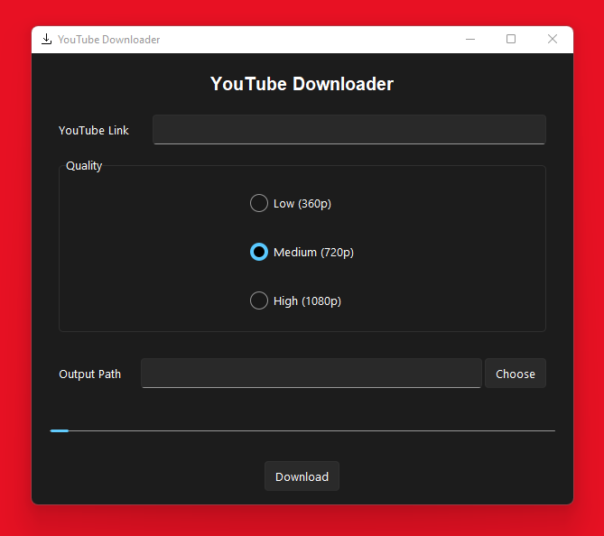
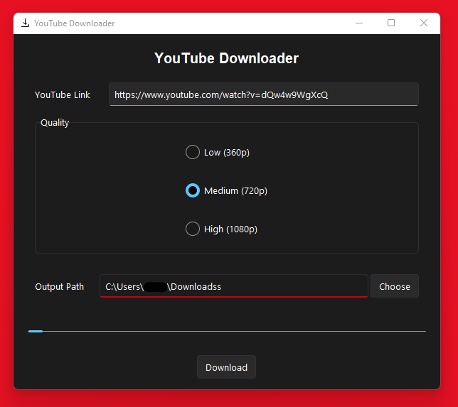
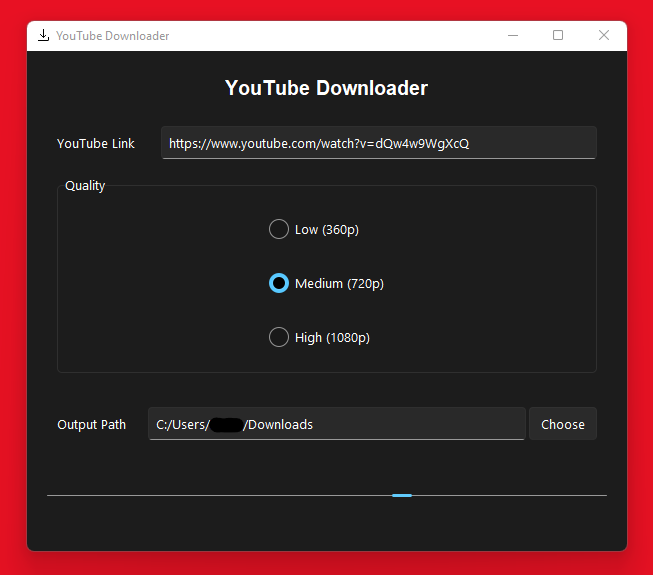
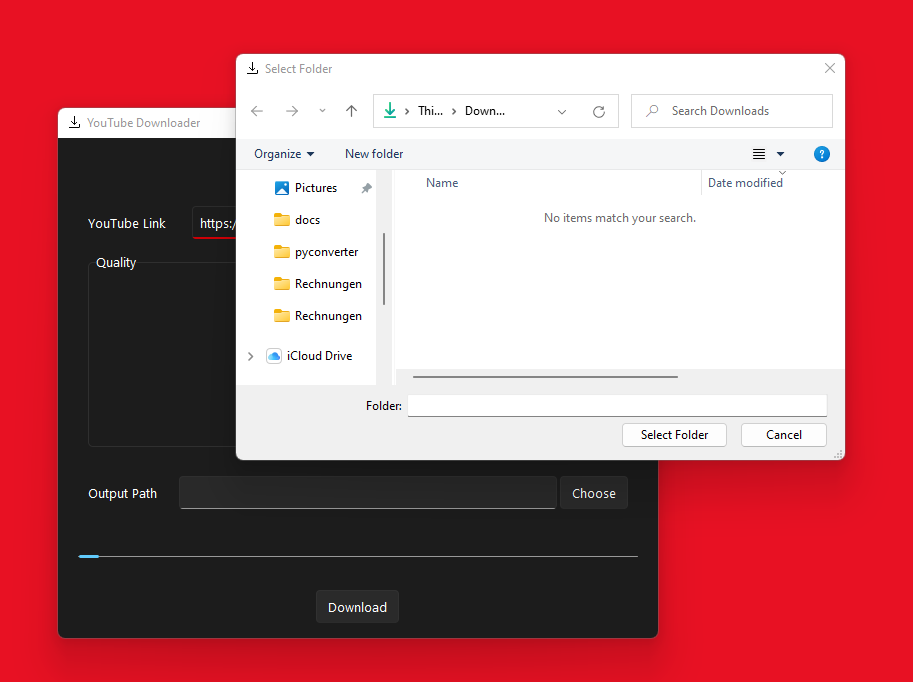
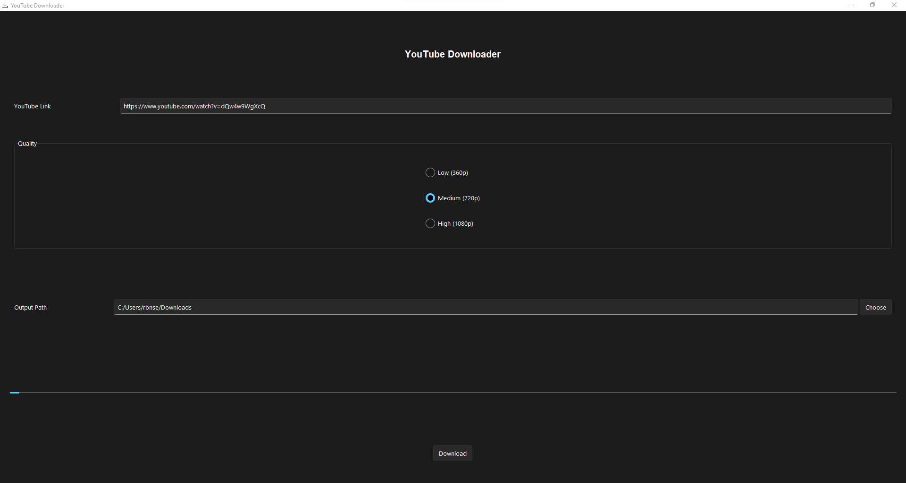

# Pyconverter
A simple cross-platform gui interface to the [pytube](https://pytube.io) library for downloading YouTube videos.

## Screenshots

### GUI  

  

### Input validation  

  
  &nbsp; &nbsp; &nbsp; &nbsp;
   

### Loading animation

  

### Ouput path selector

  

### Fully responsive

  

